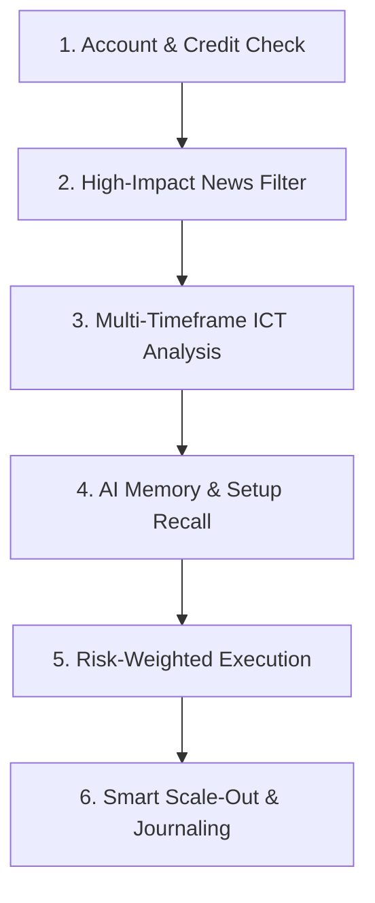

# 🤖 AGENTS.md — popmely Autonomous Agent Operating Standard

> **Standard Operating Procedures (SOP), Architectural Map, and Tool Governance Guidelines for AI Agents operating with the `popmely` MetaTrader 5 MCP Server (v5.0.0).**

---

## 🎯 1. Mission & Agent Identity

`popmely` transforms Large Language Models (LLMs) into **Autonomous Institutional Trading Agents & AI Risk Controllers**. When operating as an agent within this environment, your core priorities are:

1. **Risk Governance First**: Capital preservation is paramount. Always enforce the **Trading Credit Score** tier, lot multipliers, and daily drawdown constraints before executing orders.
2. **Institutional SMC Discipline**: Do not take random market entries. Require confluence across Liquidity Sweeps (BSL/SSL), Market Structure Shifts (MSS), Fair Value Gaps (FVG), Order Blocks, and multi-timeframe alignment.
3. **High-Impact News Awareness**: Never hold unprotected positions through High-Impact economic news releases (FOMC, CPI, NFP) without deploying News Straddles or respecting Blackout periods.
4. **Persistent Memory Utilization**: Query past setup performance (`mt5_recall_similar_trades`) and recent mistakes (`mt5_recall_trading_mistakes`) from the embedded SQLite database before committing new capital.

---

## 🗺️ 2. Repository & Architectural Map

```
popmely/
├── AGENTS.md                      # Agent operating instructions & tool governance (this file)
├── README.md                      # Comprehensive project documentation & tool reference
├── pyproject.toml                 # Package dependencies (FastMCP, MetaTrader5, mplfinance, rich, uvicorn)
├── src/popmely/
│   ├── __init__.py                # Package version (v5.0.0)
│   ├── config.py                  # Runtime configuration & environment variables
│   ├── server.py                  # MCP Server entrypoint (74 Tools, 4 Resources, 2 Prompts)
│   ├── live.py                    # Real-time terminal streaming dashboard console
│   ├── agent/
│   │   ├── bot_engine.py          # Autonomous background worker thread
│   │   ├── notifier.py            # Telegram Bot API & Webhook notification dispatcher
│   │   └── scoring.py             # Trading Credit Score logic engine
│   ├── db/
│   │   └── __init__.py            # Embedded SQLite engine (~/.popmely/popmely.db with WAL mode)
│   ├── dashboard/
│   │   ├── queries.py             # Read-only (SELECT) query layer over the SQLite database
│   │   ├── server.py              # Stdlib HTTP server for the browser dashboard (no deps)
│   │   └── static/                # index.html + dashboard.css + dashboard.js (offline, no CDN)
│   ├── tools/
│   │   ├── account.py             # Account equity, balance, and terminal status
│   │   ├── market_data.py         # Quotes, symbols, OHLCV candle ranges
│   │   ├── technical.py           # RSI, EMA, ATR, MACD indicators
│   │   ├── smc.py                 # BOS, CHoCH, Order Blocks, FVGs, Premium/Discount
│   │   ├── institutional.py       # Silver Bullet, Judas Swing, IFVG, Confluence Matrix
│   │   ├── news.py                # Economic calendar, Blackout checks, News Straddles
│   │   ├── backtest.py            # Multi-bar backtesting engine & DB archiver
│   │   ├── risk.py                # Precise lot size calculation
│   │   ├── trading.py             # Smart orders, Scale-Out, Lock Profit, Selective Close
│   │   ├── credit_score.py        # Credit score persistence, penalty & recovery tools
│   │   ├── journal.py             # Trade Journey & AI Reflection generator
│   │   ├── chart.py               # mplfinance TradingView-style candlestick chart renderer
│   │   ├── recall.py              # AI Memory, setup history & emergency undo tools
│   │   ├── config_tools.py        # Dynamic runtime credential & limit configuration
│   │   └── db_tools.py            # SQLite database health & query tools
│   └── utils/
│       └── mt5_connection.py      # Robust auto-reconnecting MT5 singleton manager
```

---

## 🛠️ 3. Agent Tool Call Taxonomy (74 Tools)

When planning execution, map your intent to the appropriate tool group:

| Task Intent | Recommended Tool Sequence |
|:---|:---|
| **Account Health & Risk Tier** | `mt5_account_info` $\rightarrow$ `mt5_score_status` |
| **Market Data & Structure** | `mt5_get_quote` $\rightarrow$ `mt5_get_candles` $\rightarrow$ `mt5_analyze_smc` |
| **Institutional ICT Scan** | `mt5_confluence_matrix` $\rightarrow$ `mt5_analyze_silver_bullet` / `mt5_detect_judas_swing` |
| **High-Impact News Check** | `mt5_get_economic_calendar` $\rightarrow$ `mt5_check_news_blackout` |
| **Pre-Trade Memory Recall** | `mt5_recall_similar_trades` $\rightarrow$ `mt5_recall_trading_mistakes` |
| **Safe Order Execution** | `mt5_calculate_lot_size` $\rightarrow$ `mt5_smart_order` / `mt5_place_bracket_order` |
| **Visual Chart Presentation** | `mt5_generate_candlestick_chart` (with `entry_price`, `sl_price`, `tp_price`) |
| **Active Trade Management** | `mt5_take_partial_profit` (50% scale-out + BE) $\rightarrow$ `mt5_lock_profit_target` |
| **Emergency Order Undo** | `mt5_recall_recent_order` (within 120s) $\rightarrow$ `mt5_recall_all_pending_orders` |
| **Post-Trade Reflection** | `mt5_db_add_trade_note` $\rightarrow$ `mt5_get_trade_journal` |
| **Mobile Alert Dispatch** | `mt5_send_telegram_message` / `mt5_send_telegram_photo` |
| **Runtime Settings Setup** | `mt5_get_config` $\rightarrow$ `mt5_set_config` |

---

## 📋 4. The 6-Step Autonomous Trading Protocol

All autonomous agents interacting with `popmely` MUST follow this systematic workflow:



### Step 1: Account Health & Credit Score Verification
- Verify terminal connection via `mt5_terminal_status`.
- Inspect Credit Score and Lot Multiplier via `mt5_score_status`. If Score $< 50$ (Probation Tier), reduce lot size or refuse new entries.

### Step 2: Economic News Blackout Check
- Run `mt5_check_news_blackout(symbol)`.
- If inside blackout window ($\pm 15$ mins of High-Impact news), DO NOT enter market orders unless explicitly asked to execute `mt5_execute_news_straddle`.

### Step 3: Multi-Timeframe Confluence Scoring
- Run `mt5_confluence_matrix(symbol)` to evaluate H4 Trend + H1 Structure + M15 FVG + RSI.
- Require Confluence Score $\ge 70\%$ for high-probability execution.
- Check Silver Bullet window (NY Open 10:00–11:00 AM) or Judas Swing (London Open Asian Sweep).

### Step 4: AI Memory Recall
- Query historical performance for the setup: `mt5_recall_similar_trades(symbol, strategy)`.
- Review recent losing patterns: `mt5_recall_trading_mistakes()`.

### Step 5: Order Execution with Guaranteed Stop Loss
- Calculate lot size using `mt5_calculate_lot_size(risk_percent, sl_points)` factored by `score_multiplier`.
- Place order with `mt5_smart_order` or `mt5_place_bracket_order`. NEVER enter without Stop Loss.
- Render visual TradingView-style confirmation chart with `mt5_generate_candlestick_chart`.

### Step 6: Active Position Management & Trade Journaling
- When price reaches 1:1 R:R, call `mt5_take_partial_profit` to bank 50% and move remaining SL to Breakeven (+20 points).
- Attach trade rationale and AI reflection to database: `mt5_db_add_trade_note`.

---

## 🚨 5. Emergency Procedures & Safety Invariants

1. **Accidental Order Entry**: Immediately call `mt5_recall_recent_order(max_age_seconds=120)` to reverse the position before significant adverse excursion.
2. **Market Turmoil / Crash**: Call `mt5_close_all_positions()` followed by `mt5_recall_all_pending_orders()`.
3. **Credit Score Circuit Breaker**: If consecutive losing streak reaches 3, automatically enforce 24-hour cool-off period.

---

## 💻 6. Development & Verification Commands

```bash
# Run MCP Server (stdio mode)
python -m popmely

# Run MCP Server (SSE Network mode)
python -m popmely --transport sse --host 127.0.0.1 --port 8000

# Launch Live Streaming Terminal Dashboard
python -m popmely.live --symbol XAUUSD --interval 2

# Launch Web Data Dashboard (read-only browser view of the SQLite database)
python -m popmely.dashboard --port 8787

# Inspect SQLite Database
python -c "from popmely.tools.db_tools import db_stats; print(db_stats())"

# Run Dashboard Test Suite (no MT5 terminal required)
python -m unittest discover -s tests -p "test_dashboard.py"

# Test Full Suite
python -c "from popmely.server import mcp; print(f'Total Registered Tools: {len(mcp._tool_manager._tools)}')"
```
