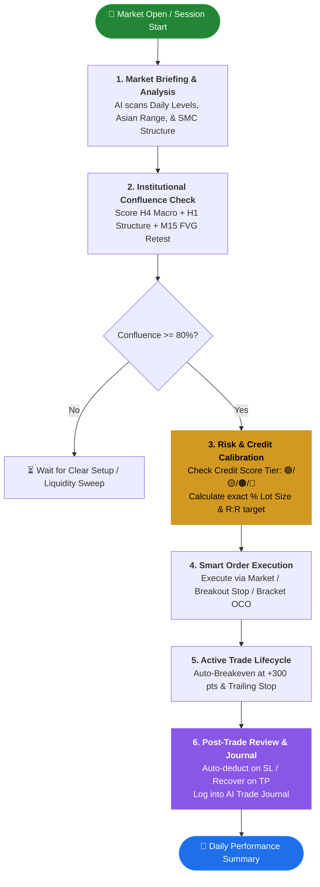
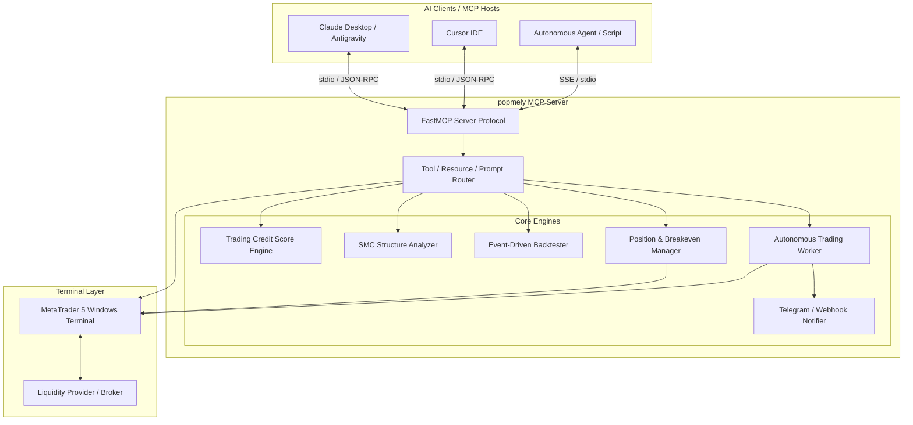
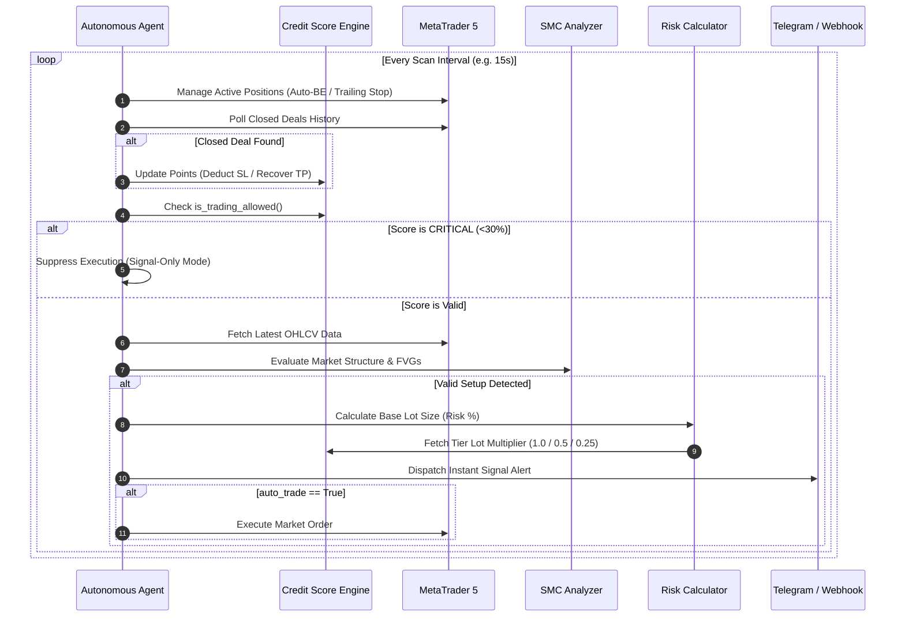

# popmely: MetaTrader 5 (MT5) Model Context Protocol (MCP) Server

[](https://github.com/JonusNattapong/popmely)
[](https://www.python.org/)
[](LICENSE)
[](https://modelcontextprotocol.io/)
[](https://www.metatrader5.com/)

**popmely** is a production-grade, asynchronous **Model Context Protocol (MCP)** server providing seamless integration between MetaTrader 5 (MT5) and Large Language Models (LLMs) such as Claude, Antigravity, Cursor, and OpenAI Agents.

It equips AI assistants with full-duplex control over financial markets—ranging from real-time price feeds, Smart Money Concept (SMC) structure analysis, bar-by-bar backtesting, automated risk calculation, and position lifecycle management, to a background autonomous trading bot with real-time Telegram alerts, a dynamic **Trading Credit Score** risk governance engine, and institutional ICT strategy models.

---

## Table of Contents

1. [Key Features](#-key-features)
2. [The Trader's Journey (Workflow)](#-the-traders-journey-workflow)
3. [System Architecture](#-system-architecture)
4. [MCP Interface Specification (45 Tools)](#-mcp-interface-specification)
5. [Institutional & ICT Strategy Models](#-institutional--ict-strategy-models)
6. [Trading Credit Score Engine](#-trading-credit-score-engine-v40)
7. [Smart Money Concepts (SMC) Analyzer](#-smart-money-concepts-smc-analyzer)
8. [Autonomous Trading Agent](#-autonomous-trading-agent)
9. [Installation & Quickstart Guide](#-installation--quickstart-guide)
10. [Client Configuration](#-client-configuration)
11. [Configuration Parameters](#-configuration-parameters)
12. [Project Evolution Journey (Changelog)](#-project-evolution-journey)
13. [Development & Testing](#-development--testing)
14. [Risk Disclaimer](#-risk-disclaimer)

---

## 🌟 Key Features

- **Standard MCP Protocol**: Fully compliant with JSON-RPC 2.0 stdio and SSE transports for interoperability across Anthropic Claude Desktop, Google Antigravity, Cursor, and custom agentic frameworks.
- **Smart Money Concepts (SMC) Engine**: Native detection of Break of Structure (BOS), Change of Character (CHoCH), Order Blocks (OB), Fair Value Gaps (FVG), Liquidity Sweeps, and Optimal Trade Entry (OTE 61.8%–78.6%).
- **Trading Credit Score System (v4.0)**: Adaptive risk governance model that adjusts trade lot sizes and halts execution dynamically based on consecutive Stop Loss hits and tier degradation.
- **Autonomous Strategy Engine**: Non-blocking background worker with configurable polling intervals, automated order execution, trailing stops, auto-breakeven, and Telegram push notifications.
- **Event-Driven Backtester**: In-memory bar-by-bar simulation engine calculating Win Rate, Profit Factor, Expected Payoff, and Maximum Drawdown with granular trade logs.
- **Strict Risk Safety Gates**: Lot size caps, max daily drawdown limits, mandatory stop-loss constraints, and slippage protection.

---

## 🗺️ The Trader's Journey (Workflow)



### The 6-Step Execution Lifecycle:

1. **Market Briefing**: Run `daily_market_briefing` to assess macro trend, support/resistance, and session ranges.
2. **Institutional Confluence**: Run `mt5_confluence_matrix` or `mt5_analyze_silver_bullet` to confirm setups with $\ge 80\%$ probability.
3. **Risk & Credit Score**: Verify `mt5_score_status` to ensure account is in **GREEN** or **YELLOW** tier; compute risk-weighted lot sizing.
4. **Smart Execution**: Dispatch orders via `mt5_smart_order`, `mt5_place_bracket_order`, or `mt5_place_grid_orders`.
5. **Lifecycle Management**: Background bot monitors trailing stops, executes auto-breakeven, and sends Telegram alerts.
6. **Journal & Governance**: Review `mt5_get_trade_journal` for performance metrics, R:R analytics, and Credit Score health.

---

## 🏗️ System Architecture



---

## 📋 MCP Interface Specification

### 1. Tools (44 Callable Functions)

#### 💼 Account & Terminal
| Tool Name | Description | Parameters |
|:---|:---|:---|
| `mt5_account_info` | Query balance, equity, margin, leverage, and floating profit. | None |
| `mt5_terminal_status` | Check terminal connection state and algo-trading permission. | None |

#### 📊 Market Data
| Tool Name | Description | Parameters |
|:---|:---|:---|
| `mt5_get_quote` | Fetch real-time Bid, Ask, Spread, and timestamps. | `symbol: str = "XAUUSD"` |
| `mt5_get_symbol_info` | Get contract sizes, digits, point size, min/max volume. | `symbol: str = "XAUUSD"` |
| `mt5_search_symbols` | Search broker's tradable asset database by keyword. | `query: str = "XAU"` |
| `mt5_get_candles` | Retrieve recent historical OHLCV candles across standard timeframes. | `symbol: str`, `timeframe: str = "M15"`, `count: int = 100` |
| `mt5_get_candles_range` | **Date/Time Range Candles**: Fetch OHLCV candles and period price change % between specific dates/hours. | `symbol: str`, `timeframe: str = "M15"`, `start_time: str`, `end_time: Optional[str] = None` |

#### 📈 Technical & SMC Analysis
| Tool Name | Description | Parameters |
|:---|:---|:---|
| `mt5_analyze_technical` | Calculate EMAs (20, 50, 200), RSI, MACD, ATR, Bollinger Bands. | `symbol: str`, `timeframe: str = "M15"`, `count: int = 100` |
| `mt5_analyze_smc` | Full SMC analysis: BOS, CHoCH, Order Blocks, FVGs, OTE levels. | `symbol: str`, `timeframe: str = "M15"`, `count: int = 100` |

#### 👑 Institutional & ICT Strategy Tools (New)
| Tool Name | Description | Parameters |
|:---|:---|:---|
| `mt5_analyze_silver_bullet` | **ICT Silver Bullet Analyzer**: Liquidity Sweeps, MSS displacement, and unmitigated FVG trigger plans (1:2.5 R:R). | `symbol: str = "XAUUSD"`, `timeframe: str = "M15"`, `count: int = 100` |
| `mt5_detect_judas_swing` | **Judas Swing & Asian Sweep**: Detects London/NY open stop hunts above/below Asian Range and generates sniper reversals. | `symbol: str = "XAUUSD"`, `count: int = 120` |
| `mt5_analyze_ifvg` | **Inversion FVG (IFVG) Scanner**: Tracks broken FVGs that have inverted roles into high-probability support/resistance. | `symbol: str = "XAUUSD"`, `timeframe: str = "M15"`, `count: int = 100` |
| `mt5_confluence_matrix` | **Multi-Timeframe Confluence Matrix**: Computes a 0-100% Institutional Confluence Score across H4, H1, M15, and RSI. | `symbol: str = "XAUUSD"` |

#### 🔬 Backtesting Engine
| Tool Name | Description | Parameters |
|:---|:---|:---|
| `mt5_run_backtest` | Run historical backtest on SMC FVG or EMA Cross strategies. | `symbol: str`, `timeframe: str = "M15"`, `strategy: str = "smc_fvg"`, `bars: int = 500`, `initial_balance: float = 10000.0`, `risk_percent: float = 1.0`, `rr_ratio: float = 2.0` |

#### 🧮 Risk Management
| Tool Name | Description | Parameters |
|:---|:---|:---|
| `mt5_calculate_lot_size` | Calculate position size by account risk %, balance, and SL distance. | `symbol: str`, `entry_price: float`, `stop_loss_price: float`, `take_profit_price: float`, `risk_percent: float = 1.0` |

#### ⚡ Smart Order & Position Execution
| Tool Name | Description | Parameters |
|:---|:---|:---|
| `mt5_place_order` | Send standard Market BUY/SELL order with SL, TP, and magic number. | `symbol: str`, `action: str ("BUY"/"SELL")`, `volume: float`, `sl: float = 0.0`, `tp: float = 0.0`, `comment: str = ""` |
| `mt5_smart_order` | **Smart Auto-Risk Order**: Computes exact lot size by % risk, verifies Credit Score, calculates TP by R:R, and executes in 1 step. | `symbol: str`, `action: str`, `sl_price: float`, `tp_price: float = 0.0`, `rr_ratio: float = 2.0`, `risk_percent: float = 1.0` |
| `mt5_place_pending_order` | Place pending Limit or Stop orders (`BUY_LIMIT`, `SELL_LIMIT`, `BUY_STOP`, `SELL_STOP`). | `symbol: str`, `order_type: str`, `price: float`, `volume: float`, `sl: float = 0.0`, `tp: float = 0.0` |
| `mt5_place_bracket_order` | **News/Breakout Straddle**: Place both BUY_STOP above and SELL_STOP below market price simultaneously. | `symbol: str`, `distance_points: float = 200.0`, `volume: float = 0.01`, `sl_points: float = 150.0`, `tp_points: float = 300.0` |
| `mt5_place_grid_orders` | **DCA / Grid Scaling**: Place multiple pending limit orders stepping down (Buy) or up (Sell) to average entry price. | `symbol: str`, `action: str`, `levels: int = 3`, `step_points: float = 150.0`, `volume_per_order: float = 0.01` |
| `mt5_get_positions` | List currently open market positions with floating PnL and tickets. | `symbol: str = ""` |
| `mt5_modify_position` | Update Stop Loss or Take Profit of an active position. | `ticket: int`, `sl: float = 0.0`, `tp: float = 0.0` |
| `mt5_close_position` | Close an active position by ticket ID with partial close support. | `ticket: int`, `volume: float = 0.0` |
| `mt5_close_all_positions` | Emergency liquidation of all active positions. | `symbol: str = ""` |
| `mt5_close_profitable_positions` | Close only profitable open positions (Profit > min_profit_usd) to lock in gains. | `symbol: str = ""`, `min_profit_usd: float = 0.0` |
| `mt5_close_losing_positions` | Close only losing open positions (Loss < -max_loss_usd) to cut losses immediately. | `symbol: str = ""`, `max_loss_usd: float = 0.0` |
| `mt5_close_by_comment` | Close open positions matching a specific comment / order name tag (e.g. 'AI_SMC', 'Manual'). | `comment_query: str`, `symbol: str = ""` |
| `mt5_close_by_magic` | Close open positions matching a specific EA Magic Number. | `magic_number: int`, `symbol: str = ""` |
| `mt5_get_pending_orders` | List all active pending orders in terminal. | `symbol: str = ""` |
| `mt5_cancel_pending_order` | Cancel a single pending order by ticket ID. | `ticket: int` |
| `mt5_cancel_all_pending_orders` | Cancel all active pending orders across terminal in one click. | `symbol: str = ""` |
| `mt5_get_trade_history` | Retrieve closed trade logs and historical deals for past N days. | `days: int = 7` |
| `mt5_get_trade_history_range` | **Date Range PnL & Deals**: Retrieve closed trades and win rate stats between specific dates. | `start_time: str`, `end_time: Optional[str] = None`, `symbol: Optional[str] = None` |
| `mt5_get_trade_journal` | **AI Trade Journey & Journal**: Generates detailed trade journey logs, R:R analytics, Credit Score impact, and AI feedback. | `days: int = 7`, `symbol: Optional[str] = None` |

#### 🤖 Autonomous Agent Management
| Tool Name | Description | Parameters |
|:---|:---|:---|
| `mt5_agent_start` | Launch background autonomous scanning and execution worker. | `symbol: str`, `timeframe: str = "M15"`, `strategy: str = "smc"`, `scan_interval: int = 15`, `auto_trade: bool = False`, `risk_percent: float = 1.0`, `rr_ratio: float = 2.0`, `enable_breakeven: bool = True`, `be_trigger_points: float = 300.0` |
| `mt5_agent_stop` | Terminate the background autonomous worker thread. | None |
| `mt5_agent_status` | Query uptime, scan count, signals generated, and execution stats. | None |
| `mt5_send_test_alert` | Dispatch test notification to Telegram / Webhook channels. | `message: str` |

#### 🛡️ Trading Credit Score (Risk Governance)
| Tool Name | Description | Parameters |
|:---|:---|:---|
| `mt5_score_init` | Initialize or configure credit score and reference portfolio balance. | `max_score: float = 100.0`, `initial_balance: float = 10000.0`, `base_multiplier: float = 100.0`, `recovery_rate: float = 0.5` |
| `mt5_score_status` | Retrieve current score, tier, lot multiplier, and streak counters. | None |
| `mt5_score_deduct` | Deduct points upon SL hit with automatic losing streak penalty. | `loss_usd: float`, `reason: str = "SL Hit"` |
| `mt5_score_recover` | Recover points upon TP hit (50% of deduction rate). | `profit_usd: float` |
| `mt5_score_reset` | Reset score to initial maximum capacity. | None |
| `mt5_score_set` | Manually override score value for manual risk calibration. | `score: float` |
| `mt5_score_history` | Audit log of score modifications, penalties, and recoveries. | `limit: int = 20` |

---

### 2. Resources (Read-Only State)

Read-only context URIs accessible by LLMs to inject situational awareness into conversation contexts:

| URI | Content Schema | Description |
|:---|:---|:---|
| `mt5://account/status` | `application/json` | Real-time equity, balance, margin levels, and terminal status. |
| `mt5://positions/active` | `application/json` | Active position tickets, floating profit, and entry pricing. |
| `mt5://config/limits` | `application/json` | Safety thresholds, max lot size, and default parameters. |
| `mt5://score/status` | `application/json` | Credit score tier, active lot multiplier, and streak metrics. |

---

### 3. Prompts (Pre-Built Workflows)

Interactive prompt workflows registered on the MCP server:

- **`daily_market_briefing`**: Synthesizes account health, credit score tier, multi-timeframe technical momentum (H1/M15), and SMC structural zones into an actionable daily briefing.
- **`smc_trade_setup`**: Evaluates Premium/Discount pricing, unmitigated FVGs/OBs, calculates risk-weighted lot sizing adhering to current score tier rules, and prepares entry plans.

---

## 🛡️ Trading Credit Score Engine (v4.0)

The **Trading Credit Score** system prevents catastrophic drawdown through dynamic risk scaling and autonomous circuit breaking.

### Tier Classifications

```
   100% ┌──────────────────────────────────────────────┐
        │  🟢 GREEN TIER (70% - 100%)                  │  → Standard Trading (100% Lot Size)
    70% ├──────────────────────────────────────────────┤
        │  🟡 YELLOW TIER (50% - 70%)                  │  → Cautious Mode (50% Lot Size)
    50% ├──────────────────────────────────────────────┤
        │  🟠 ORANGE TIER (30% - 50%)                  │  → Warning Mode (25% Lot Size + Alerts)
    30% ├──────────────────────────────────────────────┤
        │  🔴 CRITICAL TIER (< 30%)                    │  → CIRCUIT BREAKER (Trading Blocked)
     0% └──────────────────────────────────────────────┘
```

### Mathematical Model

#### Deduction Formula (SL Hit)
$$\Delta \text{Score}_{\text{deduct}} = \left( \frac{\text{Loss}_{\text{USD}}}{\text{Balance}_{\text{ref}}} \times \text{Multiplier}_{\text{base}} \right) \times \text{StreakMultiplier}$$

$$\text{StreakMultiplier} = \begin{cases} 1.0 & \text{if Streak} \le 2 \\ 1.5 & \text{if } 3 \le \text{Streak} \le 4 \\ 2.0 & \text{if Streak} \ge 5 \end{cases}$$

#### Recovery Formula (TP Hit)
$$\Delta \text{Score}_{\text{recover}} = \left( \frac{\text{Profit}_{\text{USD}}}{\text{Balance}_{\text{ref}}} \times \text{Multiplier}_{\text{base}} \right) \times \text{RecoveryRate} \quad (\text{Default: } 0.50)$$

*Score recovery occurs at 50% velocity relative to penalties to encourage disciplined risk management.*

---

## 🧠 Smart Money Concepts (SMC) Analyzer

The built-in SMC engine calculates institutional market structure directly from OHLCV arrays:

1. **Swing Highs / Lows**: Multi-bar fractal pivot identification.
2. **Break of Structure (BOS)**: Continuation signals validated by candle body closes.
3. **Change of Character (CHoCH)**: Early trend reversal identification.
4. **Fair Value Gaps (FVG)**: 3-candle imbalance zones tracked for mitigation state.
5. **Order Blocks (OB)**: High-volume institutional origin candles.
6. **Premium vs. Discount Zones**: Equilibrium calculations based on dealing ranges.
7. **Optimal Trade Entry (OTE)**: Fibonacci retracement zones (61.8%, 70.5%, 78.6%).

---

## 🤖 Autonomous Trading Agent

The autonomous agent runs on a non-blocking background thread (`daemon=True`) to perform continuous market scanning:



---

## 🚀 Installation & Quickstart Guide

### ⚡ 5-Minute Quickstart (Windows PowerShell)

```powershell
# 1. Clone the repository
git clone https://github.com/JonusNattapong/popmely.git
cd popmely

# 2. Create and activate virtual environment
python -m venv .venv
.venv\Scripts\activate

# 3. Install dependencies and package
pip install -e .

# 4. Copy environment configuration
Copy-Item .env.example .env

# 5. Verify installation
python -c "import popmely; print(f'🎉 popmely v{popmely.__version__} is ready!')"
```

---

### 🖥️ Step 1: MetaTrader 5 Terminal Configuration

1. Open your **MetaTrader 5** terminal.
2. Log into your Demo or Live trading account.
3. Enable Automated Trading:
   - Go to top menu: **`Tools`** > **`Options`** (or press `Ctrl + O`).
   - Select the **`Expert Advisors`** tab.
   - ✅ Check **"Allow Algo Trading"**.
   - ✅ Check **"Allow WebRequest for listed URL"** (if using Webhooks).
   - Click **OK**.

---

### 📱 Step 2: Telegram Push Notification Setup (Optional)

To receive real-time signal alerts and credit score warnings:

1. Open Telegram and search for **`@BotFather`**.
2. Send `/newbot` and follow the prompts to create your bot $\rightarrow$ copy the **`TELEGRAM_BOT_TOKEN`**.
3. Search for **`@userinfobot`** $\rightarrow$ start it to get your personal **`TELEGRAM_CHAT_ID`**.
4. Edit your `.env` file:
   ```env
   TELEGRAM_BOT_TOKEN=123456789:ABCdefGhIJKlmNoPQRstuvWxyz
   TELEGRAM_CHAT_ID=987654321
   ```
5. Test your alert:
   ```bash
   python -c "from popmely.agent.notifier import notifier; notifier.send_alert('🚀 popmely alert is working!')"
   ```

---

## ⚙️ Client Configuration

### Claude Desktop (`claude_desktop_config.json`)

Add popmely to your Claude Desktop configuration located at `%APPDATA%\Claude\claude_desktop_config.json`:

```json
{
  "mcpServers": {
    "popmely": {
      "command": "python",
      "args": [
        "-m",
        "popmely"
      ],
      "env": {
        "PYTHONIOENCODING": "utf-8"
      }
    }
  }
}
```

### Google Antigravity / Cursor IDE (`mcp.json`)

```json
{
  "mcpServers": {
    "popmely": {
      "command": "python",
      "args": [
        "d:\\Projects\\Github\\popmely\\src\\popmely\\server.py"
      ],
      "env": {
        "PYTHONIOENCODING": "utf-8"
      }
    }
  }
}
```

### Direct CLI Invocation

```bash
# Standard stdio mode
python -m popmely

# FastMCP SSE Transport mode
python -m popmely --transport sse --host 127.0.0.1 --port 8000
```

---

## 🔧 Configuration Parameters

Create a `.env` file in the project root to override default settings:

```env
# Optional: Auto-login credentials (Leave blank to use active MT5 terminal session)
MT5_ACCOUNT=
MT5_PASSWORD=
MT5_SERVER=
MT5_PATH=

# Trading Defaults
DEFAULT_SYMBOL=XAUUSD
DEFAULT_MAGIC=112233
DEFAULT_DEVIATION=20
MAX_SLIPPAGE_POINTS=50

# Safety Controls
MAX_LOT_SIZE=1.0
MAX_DAILY_DRAWDOWN_PERCENT=5.0
REQUIRE_SL=false

# Push Notifications
TELEGRAM_BOT_TOKEN=your_bot_token_here
TELEGRAM_CHAT_ID=your_chat_id_here
WEBHOOK_URL=https://your-webhook-endpoint.com/api
```

---

## 🚀 Project Evolution Journey

The evolution of `popmely` from a basic MT5 bridge to an institutional AI trading server:

```
v1.0.0 (Core Bridge) ──► v2.0.0 (SMC & Backtest) ──► v3.1.0 (Autonomous Bot) ──► v4.0.0 (Credit Score) ──► v4.5.0 (Institutional Mastery)
```

| Milestone | Version | Release Highlights | Key Tools Added |
|:---|:---:|:---|:---|
| **The Genesis Bridge** | `v1.0.0` | Initial bridge between MT5 terminal and AI models via MCP protocol. | Account Info, Quote Feed, Place/Close Order |
| **SMC & Quantitative Engine** | `v2.0.0` | Introduced Smart Money Concepts analyzer and bar-by-bar backtest simulation. | BOS, CHoCH, OB, FVG, Backtest Engine |
| **Autonomous AI & Protocol** | `v3.1.0` | Standardized to FastMCP, background autonomous scanning worker, and Telegram alerts. | Agent Worker, Auto-BE, Trailing Stop, Telegram Notifier |
| **Trading Credit Score** | `v4.0.0` | Adaptive risk governance engine that scales lot sizes and halts trading on drawdown. | Credit Score Tiers (GREEN/YELLOW/ORANGE/CRITICAL) |
| **Institutional Mastery** | `v4.5.0` | Institutional ICT strategies, Smart entry orders, Selective position closing, and Date range queries. | Silver Bullet, Judas Swing, IFVG, Confluence, Trade Journal (45 Tools) |

---

## 🧪 Development & Testing

Run unit and integration test suites:

```bash
# Run test suite
python -m unittest discover -s tests

# Direct module verification
python -c "import popmely; print(f'Loaded popmely v{popmely.__version__}')"
```

---

## ⚠️ Risk Disclaimer

> **IMPORTANT**: Trading foreign exchange, commodities, cryptocurrencies, and CFDs carries a high level of risk and may not be suitable for all investors. High leverage can work against you as well as for you.
>
> This software is provided for research, educational, and workflow automation purposes. Always test all strategies extensively on **Demo Accounts** before deploying real capital. The author and contributors accept no responsibility for financial losses incurred through the use of this software.

---

## 📄 License

This project is licensed under the **MIT License** - see the [LICENSE](LICENSE) file for details.

Maintained with ❤️ by [JonusNattapong](https://github.com/JonusNattapong).
